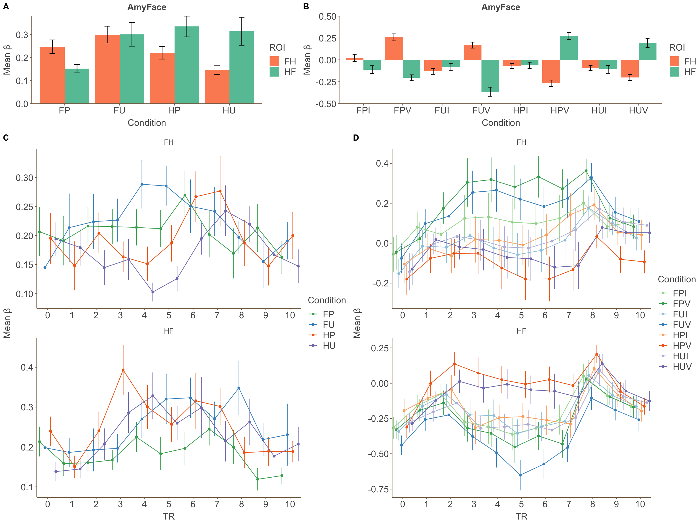

# These are the scripts for Amygdala analysis

## preprocess
Do preorocessing
* `to3d` &emsp;to merge DICOM file              > \_o+orig.BRIK
* `3dvolreg` &emsp;to align to the middle image   > r_bs1+orig func_s.mot
* `3dTsmooth` &emsp;compute means for smoothing > \_f+orig
* `3dmerge` &emsp;use means to smooth           > \_merge+orig
* `3dAutomask` &emsp;generate whole brain mask  > \_mask+orig
* `3dTstat` &emsp;calculate means               > \_merge+orig
* `3dcalc` &emsp;apply means (a/b * 100)        > \_s+orig
* `3dTcat` &emsp;concatenate runs               > func_s+orig
* `3dcalc` &emsp;apply whole brain mask         > SXX_func_s+orig
* `align_epi_anat.py` &emsp;process structural image and align last epi image to structural imagee (last 8 subjects) or whole brain epi image (first 12 subjects) > str_al+orig
* `@auto_tlrc` &emsp;align to MNI152_T1_2009c+tlrc > str_al+tlrc

## 3Deconvolve
Use `3dDeconvolve` (BLOCK function 'BLOCK(10,1)') to get these results and align to structural image (MNI152_T1_2009c+tlrc )
* OlfacValence: Upleasant > Pleasant
* FaceValence: Fearful > Happy
* Visible OlfacValence: Upleasant > Pleasant
* Visible FaceValenceF: Fearful > Happy  

The results are stored in `${subj}.analysis.+tlrc`, this file is then used to generate masks for Amygdala

## resample
Use `3dresample` to generate atlas masks from BN_atlas and use ROIresample to change voxel size (the same as MNI152_T1_2009c+tlrc )
* lateralAmy
* medialAmy
* Amygdala

## makesepROI05
Use `3dcalc` to generate final masks in the BN_atlas lateralAmy and medialAmy whose activity in Upleasant >/< Pleasant or Fearful >/< Happy （seperate two directions）

Use 3dROIstats to print the mean value to txt files

## ROIstatent
Use `3dROIstats` to print the mean $\beta$ value to txt files

## ../FFA_STS/extract_block
Get data from the txt file.
Data are stored in Amyblock.RData

## ../Amygdala/extract_tent
Get data from the txt file.
Because the structures of data generated by tent and block function are different, extract_block.R can not be used here.

## analyzeR
Analyze data stored in RData file and generate All.RData

## ../AmygdalaTENT/analyzeRtent
Analyze data stored in tent.RData file and generate Alltent.RData

## plot_Amy
Analyze data stored in All.RData and ../AmygdalaTENT/Alltent.RData, then generate a html file with plots

## Other files
These files have been used but are not crucial in data analysis

### makeROI
Make masks for amygdala that activity significantly (t>1.65) in Upleasant >&< Pleasant or Fearful >&< Happy (merge two directions)

### makeROI05
Make masks for amygdala that activity significantly (t>1.96) in Upleasant >&< Pleasant or Fearful >&< Happy (merge two directions)

### rename
Change the data folder name from S0XX to SXX so that it can match the name of the data files

### usefulcmd
Generate commands to run in parallel

### check
Prompt GUI to check alignment one by one

### checkdata
Apply masks to analysis.+tlrc to check activity

### saveimg
Use afni commands to automatically save images about alignment

### read.m
Matlab script to read data in xlsx files (copy from txt files) and then store in draw.xlsx

### analysis.m
Matlab script to analysis data in draw.xlsx
