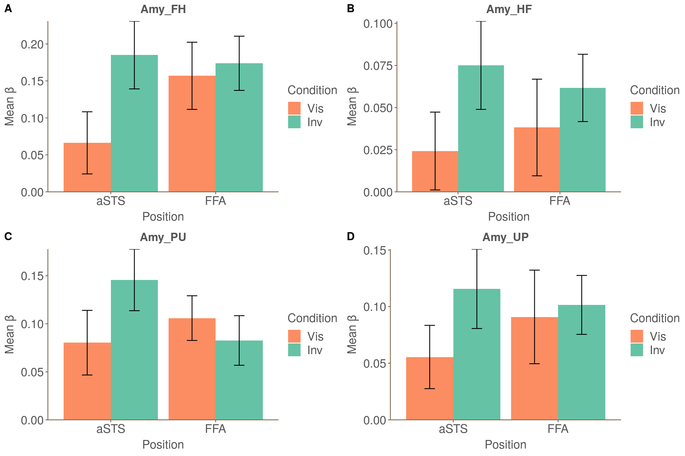

# These are the scripts for PPI analysis

## generTiming
Copy and rename timing files from the first 12 subjects and the last 8 subjects

## timing_trans.m
Matlab script that can trans 1D timing files (1 and 0 that represent stimuli onset or not) to txt timing files (time points for stimuli onset)

## timing5run
Use `split` command to split a whole timing file into 5 runs

## PPIpreprocess
Prepocess 5 runs and align to anatomical image.

## PPIregressor
Generate PPI regressors for a certain condition
* `Seed_${mask}.1D`
* `Inter_Invisible_${mask}.1D`
* `Inter_Visible_${mask}.1D`

Use `3dDeconvolve` to get PPI results, which are stored in `${subj}.${mask}_PPI+tlrc`

Change these parameters to analyze different conditions and masks
`set valance=OdorValence`
[OdorValence FaceValence]
`set mask=AmyPU`
[Amy lateralAmy medialAmy] + [FH HF UP PU]

## ROIstatPPI
Use `3dROIstats` to print mean $\beta$ values and *t* values to txt files

Change this parameter to use different masks the same as PPIregressor
`set mask=AmyPU`
[Amy lateralAmy medialAmy] + [FH HF UP PU]

## extract_ppi
Get data from the txt file.
The data are stored in PPI.RData

## analyzeRppi
Analyze data stored in RData file and generate All.RData

## plot_PPI
Analyze data stored in All.RData, then generate a html file with plots

